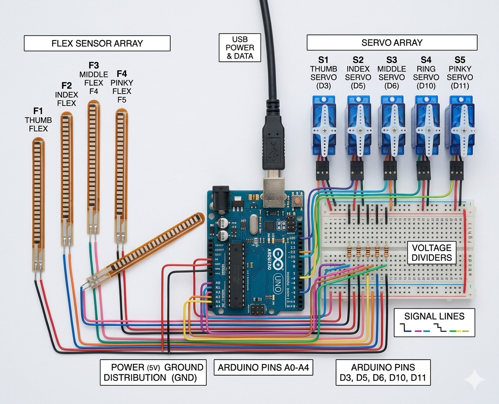

# Flex Sensor Controlled Robotic Arm

Arduino-based robotic arm controlled using flex sensors and servo motors.  
The bending of the flex sensor changes resistance, which is read by the Arduino and mapped to servo motor angles to mimic human hand motion.

---

## Hardware Components

- Arduino Uno
- Flex Sensor
- Servo Motors
- Breadboard
- Resistors
- Jumper wires

---

## Working Principle

Flex sensors change their resistance when bent.  
The Arduino reads this analog value and converts it into servo motor angles using a mapping function.  
This allows the robotic arm to move according to the bending of the flex sensor.

---

## Circuit Diagram

---

## Project Demo

Tinkercad Simulation:  
https://www.tinkercad.com/things/3Su9y99MC0V-robotic-hand

---

## 3D Model

Robotic arm 3D model generated using Tripo AI.

View the model here:  
https://studio.tripo3d.ai/workspace/generate/8b3533cb-43fa-48ff-afac-3247776b2f5b

---

## Author

Santhosh Kamatchi P  
Embedded Software Engineer
