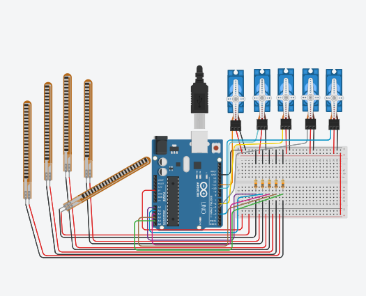

# flex-sensor-robotic-arm-arduino
Arduino based robotic arm controlled using flex sensors and servo motors.

## 3D Model

Robotic arm 3D model generated using Tripo AI.

View the model here:
[3D_MODEL_LINK_HERE](https://studio.tripo3d.ai/workspace/generate/8b3533cb-43fa-48ff-afac-3247776b2f5b)

## Circuit Diagram

